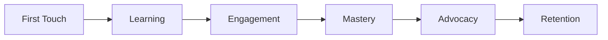

# 🎮 Player Journey

> [!abstract] **The Learning Arc**
> From confused beginner to logistics expert - how players grow and stay engaged over time.

#player-journey #progression #onboarding #mastery

---

## 🎯 Journey Overview

### 🎲 **The Complete Arc**

### ⏱️ **Time Investment**
- **First 90 seconds:** Hook or lose them
- **First 5 minutes:** Core loop understood
- **First session:** Want to come back
- **First week:** Developing skill
- **First month:** Feels like "their" game

---

## 🚀 Phase 1: First Touch (0-90 seconds)

### 🎯 **Goal: Immediate Engagement**
*Get them building and seeing results instantly*

### 🎮 **Player Experience**
> [!success] **What They See**
> *"Oh, I drag to build roads? And trucks actually move? This is cool!"*

### 🛠️ **Game Elements**
- **Pre-built starter scenario** - No empty grid paralysis
- **One obvious connection** - Clear first move
- **Immediate feedback** - Trucks move as soon as road is built
- **Quick success** - First delivery completes in 30 seconds

### 🎯 **Success Metrics**
- **90%** complete their first road connection
- **80%** see their first successful delivery
- **70%** attempt a second road connection

### 🎲 **Supporting Systems**
- [[📊 Tutorial System]] - Invisible guidance
- [[📊 Visual Feedback]] - Immediate road building response
- [[📊 Simplified UI]] - Only essential elements shown

---

## 🎓 Phase 2: Learning (2-20 minutes)

### 🎯 **Goal: Understanding the Game**
*Help them grasp all three [[🏗️ Gameplay Pillars]]*

### 🎮 **Player Experience**
> [!tip] **Strategic Thinking Emerges**
> *"Wait, this route is cheaper but slower... which is better?"*

> [!note] **Automation Appreciation**
> *"I love how the trucks just figure out where to go!"*

### 🛠️ **Game Elements**
- **Level 1:** Basic connection (1 farm → 1 factory → 1 store)
- **Level 2:** Two products (introduces choice and priority)
- **Level 3:** Budget constraint (introduces strategic thinking)
- **Level 4:** Terrain obstacle (introduces creative problem-solving)

### 📚 **Learning Progression**
1. **Basic Mechanics** - Road building, truck movement
2. **Strategic Thinking** - Route optimization, budget management
3. **System Understanding** - Production chains, automation benefits
4. **Challenge Acceptance** - Obstacles as puzzles to solve

### 🎯 **Success Metrics**
- **85%** complete tutorial sequence
- **75%** retry a level for better score
- **60%** complete all tutorial levels

---

## 🎯 Phase 3: Engagement (20 minutes - 1 week)

### 🎯 **Goal: Developing Skill**
*Players start to feel competent and want to improve*

### 🎮 **Player Experience**
> [!success] **Growing Confidence**
> *"I'm getting pretty good at this! Let me try that tricky level again."*

> [!warning] **Challenge Accepted**
> *"This level seems impossible... but I bet I can figure it out."*

### 🛠️ **Game Elements**
- **Varied Scenarios** - Different map layouts and constraints
- **Efficiency Scoring** - Clear metrics for improvement
- **Replay Incentives** - 3-star system encourages perfection
- **New Mechanics** - Bridges, terrain types, multi-product chains

### 🎲 **Challenge Progression**
1. **Terrain Mastery** - Rivers, mountains, forests
2. **Economic Optimization** - Maximum efficiency with minimum cost
3. **Complex Logistics** - Multiple factories, diverse product chains
4. **Time Pressure** - Faster customer demands

### 🎯 **Success Metrics**
- **70%** replay levels for better scores
- **60%** complete 10+ levels
- **50%** achieve 3-star rating on multiple levels

---

## 🏆 Phase 4: Mastery (1 week - 1 month)

### 🎯 **Goal: Expert-Level Play**
*Players become logistics experts with personal strategies*

### 🎮 **Player Experience**
> [!tip] **Expert Thinking**
> *"I can see the optimal solution immediately now. Let me execute it perfectly."*

> [!success] **Teaching Others**
> *"You have to try this game - look at this crazy efficient network I built!"*

### 🛠️ **Game Elements**
- **Advanced Scenarios** - Multi-objective challenges
- **Leaderboards** - Competition with other players
- **Daily Challenges** - Fresh content regularly
- **Prestige Mechanics** - Reset progression for greater challenges

### 🎲 **Mastery Indicators**
- **Route Optimization** - Instantly spot efficient paths
- **Cost Calculation** - Intuitively balance budget vs. efficiency
- **System Thinking** - Understand complex interaction effects
- **Creative Solutions** - Find non-obvious approaches

### 🎯 **Success Metrics**
- **40%** consistently achieve 3-star ratings
- **30%** complete advanced challenge levels
- **20%** share achievements or screenshots

---

## 🔄 Phase 5: Advocacy & Retention (1 month+)

### 🎯 **Goal: Long-term Engagement**
*Transform players into advocates and regular returners*

### 🎮 **Player Experience**
> [!note] **Personal Connection**
> *"This is 'my' game - I always come back to it when I want to relax and think."*

> [!success] **Community Building**
> *"My friends need to play this. Let me show them my best solutions."*

### 🛠️ **Game Elements**
- **Fresh Content** - Weekly new levels or challenges
- **Social Features** - Share solutions, compare scores
- **Achievement System** - Long-term goals and recognition
- **Seasonal Events** - Special themed challenges

### 🎯 **Retention Strategies**
- **Habit Formation** - Daily challenges, consistent rewards
- **Social Proof** - Leaderboards, shared achievements
- **Skill Expression** - Platforms to showcase expertise
- **Continuous Learning** - New mechanics, advanced strategies

---

## 🎯 Emotional Journey Mapping

### 😊 **Positive Emotions to Cultivate**
- **Curiosity** → **Satisfaction** → **Pride** → **Mastery** → **Advocacy**

### 😤 **Negative Emotions to Avoid**
- **Confusion** - Clear tutorials and guidance
- **Frustration** - Difficulty scaling and hint systems
- **Boredom** - Variety and progressive challenges
- **Abandonment** - Re-engagement hooks and comeback bonuses

### 🎯 **Emotional Checkpoints**
- **30 seconds:** Intrigued and engaged
- **5 minutes:** Understanding and enjoying
- **1 session:** Satisfied and planning return
- **1 week:** Developing skill and attachment
- **1 month:** Feels like "their" game

---

## 🔗 Supporting Systems

This journey is enabled by:
- [[🎯 Vision & Core Experience]] - Overall experience design
- [[🏗️ Gameplay Pillars]] - Core mechanics that grow with skill
- [[📊 Tutorial System]] - Seamless learning progression
- [[📊 Level Progression]] - Carefully designed difficulty curve
- [[📊 Scoring System]] - Clear feedback and improvement metrics

---

*Updated: 2025-07-11*
*Tags: #player-journey #progression #onboarding #tutorial #mastery #retention*