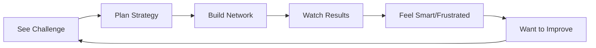

# 🎯 Vision & Core Experience

> [!abstract] **One-Line Vision**
> *"The satisfying puzzle of building the perfect logistics network, one strategic decision at a time."*

#game-vision #core-experience #mobile-first

---

## 🎮 What Players Experience

### The Perfect Session
Imagine you're a player with 5 minutes on your commute:

1. **🧩 The Challenge Appears** - You see a map with scattered farms, factories, and a store
2. **💡 The "Aha!" Moment** - You spot a clever route that others might miss
3. **🛠️ Strategic Building** - Every road tile costs money, every choice matters
4. **⚡ The Flow State** - Trucks move, goods flow, customers get happy
5. **🏆 The Satisfaction** - You beat your efficiency score and feel genuinely clever

### Core Emotional Journey

> [!success] **Early Game Feeling**
> *"I'm learning the rules and discovering what works"*

> [!warning] **Mid-Game Tension**
> *"I'm running out of money - this route better pay off!"*

> [!note] **Late Game Mastery**
> *"I can see the optimal solution now - let me perfect it"*

---

## 🏗️ Three Gameplay Pillars

### 1. 🧠 Strategic Puzzle-Solving
- **Core Question:** *"What's the smartest way to connect these points?"*
- **Player Action:** Planning routes before building
- **Emotional Reward:** Feeling clever when you find the optimal path

### 2. 💰 Resource Management Drama
- **Core Question:** *"Can I afford this shortcut, or should I go the long way?"*
- **Player Action:** Balancing risk vs. reward in spending
- **Emotional Reward:** Tension and relief when gambles pay off

### 3. ⚡ Optimization Satisfaction
- **Core Question:** *"How can I make this even more efficient?"*
- **Player Action:** Iterating and improving on previous attempts
- **Emotional Reward:** Pride in incremental mastery

---

## 🎯 Target Player Profile

### Primary Audience: **The Commuter Strategist**
- **Age:** 25-45
- **Gaming Time:** 5-20 minute sessions
- **Motivation:** Mental stimulation during downtime
- **Frustration:** Games that waste their time or feel mindless

### What They Love:
- Quick mental challenges
- Seeing immediate results from smart decisions
- Replayability with different approaches
- Clean, uncluttered experiences

### What They Hate:
- Forced waiting/timers
- Complex tutorials
- Pay-to-win mechanics
- Sessions that can't be paused

---

## 🔄 Core Experience Loop

### The 90-Second Hook
1. **0-10s:** Map appears, player immediately sees the challenge
2. **10-30s:** Player starts building their first road connections
3. **30-60s:** First trucks move, first deliveries happen
4. **60-90s:** Player sees their score and immediately wants to try again

---

## 🎨 Aesthetic & Tone

### Visual Philosophy: **"Friendly Engineering"**
- Clean, technical feel without being intimidating
- Colorful but not childish
- Information-dense but not overwhelming
- Satisfying visual feedback for smart decisions

### Emotional Tone Tags:
`#clever` `#efficient` `#rewarding` `#strategic` `#bite-sized`

---

## 🚀 Success Metrics

### Player Engagement
- **Session Length:** 3-8 minutes average
- **Retry Rate:** >60% of players retry levels for better scores
- **Completion Rate:** >80% finish tutorial levels

### Emotional Success
- **"Aha!" Moments:** Players discover non-obvious optimal solutions
- **Progressive Mastery:** Players can articulate why their second attempt was better
- **Replayability:** Players return to improve previous scores

---

## 🔗 Connected Systems

This vision connects to:
- [[🏗️ Gameplay Pillars]] - Detailed mechanics that support these pillars
- [[🎮 Player Journey]] - How the experience unfolds over time
- [[📊 Systems Reference]] - Technical implementation of these experiences

---

*Updated: 2025-07-11*
*Tags: #game-design #vision #mobile-game #logistics #strategy*