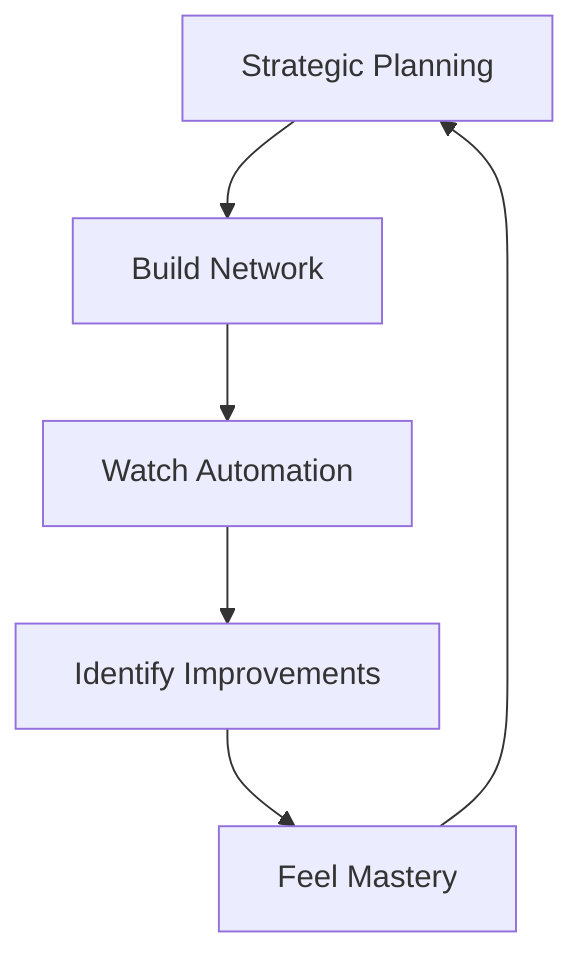

# 🏗️ Gameplay Pillars

> [!abstract] **Foundation**
> These three pillars define what makes the game fun and replayable. Every feature should strengthen at least one pillar.

#gameplay-pillars #core-mechanics #fun-factors

---

## 🧠 Pillar 1: Strategic Infrastructure Planning

### 🎯 **Core Fantasy**
*"I'm a logistics mastermind designing the perfect network."*

### 🎮 **Player Actions**
- **Road Network Design** - Every connection matters
- **Building Placement** - Strategic positioning for efficiency
- **Route Optimization** - Finding clever paths others miss
- **Budget Management** - Balancing cost vs. speed

### 🌟 **Fun Moments**
> [!success] **The "Aha!" Moment**
> *"Wait, if I connect here instead of there, I save 3 road tiles AND get better delivery times!"*

> [!tip] **The Engineering High**
> *"My road network is so efficient, I'm delivering faster than anyone expected"*

### 🎲 **Strategic Depth**
- **Multiple Solutions** - Same problem, different approaches
- **Risk vs. Reward** - Expensive direct routes vs. cheaper winding paths
- **Emergent Complexity** - Simple rules create complex decisions
- **Resource Constraints** - Limited budget forces tough choices

### 🔗 **Supporting Systems**
- [[📊 Road Building System]] - Core infrastructure mechanics
- [[📊 Economic System]] - Budget constraints and income
- [[📊 Pathfinding]] - Route efficiency calculations

---

## ⚡ Pillar 2: Flow State Automation

### 🎯 **Core Fantasy**
*"I built this amazing machine, and now I get to watch it work perfectly."*

### 🎮 **Player Actions**
- **System Observation** - Watching your creation in action
- **Bottleneck Identification** - Spotting where improvements are needed
- **Iterative Refinement** - Making small improvements for big gains
- **Performance Monitoring** - Tracking efficiency metrics

### 🌟 **Fun Moments**
> [!note] **The Satisfaction Loop**
> *"I just made one small change and suddenly everything flows better!"*

> [!success] **The Perfect Run**
> *"Every truck is busy, every delivery is on time, this is beautiful"*

### 🎲 **Automation Design**
- **Demand-Driven Logic** - Stores request what they need
- **Smart Truck Routing** - System finds optimal paths automatically
- **Visual Feedback** - Clear indicators of system health
- **Hands-Off Operation** - No micromanagement required

### 🔗 **Supporting Systems**
- [[📊 Transport System]] - Automated truck logistics
- [[📊 Production Chain]] - Continuous flow mechanics
- [[📊 Visual Feedback]] - System status indicators

---

## 🎯 Pillar 3: Incremental Mastery

### 🎯 **Core Fantasy**
*"I'm getting better at this, and I can prove it with my scores."*

### 🎮 **Player Actions**
- **Score Optimization** - Beating personal bests
- **Efficiency Improvement** - Doing more with less
- **Strategy Evolution** - Learning from previous attempts
- **Challenge Progression** - Tackling harder scenarios

### 🌟 **Fun Moments**
> [!tip] **The Improvement High**
> *"I just beat my previous efficiency score by 15%!"*

> [!warning] **The Challenge Accepted**
> *"This level looks impossible... but I bet I can figure it out"*

### 🎲 **Mastery Progression**
- **Skill-Based Scoring** - Efficiency over time/luck
- **Replayable Challenges** - Same levels, better strategies
- **Clear Progression** - Visible improvement metrics
- **Difficulty Scaling** - More complex scenarios unlock

### 🔗 **Supporting Systems**
- [[📊 Scoring System]] - Efficiency-based metrics
- [[📊 Level Progression]] - Increasing complexity
- [[📊 Player Analytics]] - Performance tracking

---

## 🔄 Pillar Interactions

### 🎯 **How They Work Together**

### 🎮 **Synergy Examples**
- **Planning + Automation** - Better plans create more satisfying automation
- **Automation + Mastery** - Smooth systems reveal optimization opportunities
- **Mastery + Planning** - Experience leads to better strategic decisions

### ⚖️ **Balance Considerations**
- **Too Much Planning** - Analysis paralysis, decision fatigue
- **Too Much Automation** - Player feels disconnected from outcomes
- **Too Much Mastery Focus** - Casual players feel excluded

---

## 🎯 Design Principles

### ✅ **Strengthen Pillars**
- Does this feature make planning more strategic?
- Does this feature make automation more satisfying?
- Does this feature support skill development?

### ❌ **Avoid Pillar Conflicts**
- Don't add micromanagement that breaks automation
- Don't add randomness that undermines strategic planning
- Don't add complexity that obscures mastery progression

### 🎯 **Feature Evaluation**
Every new feature should ask: *"Which pillar does this strengthen, and how?"*

---

## 🔗 Connected Systems

These pillars are supported by:
- [[🎯 Vision & Core Experience]] - Overall player experience
- [[🎮 Player Journey]] - How pillars evolve over time
- [[📊 Systems Reference]] - Technical implementation details

---

*Updated: 2025-07-11*
*Tags: #gameplay-pillars #core-mechanics #strategic-planning #automation #mastery*