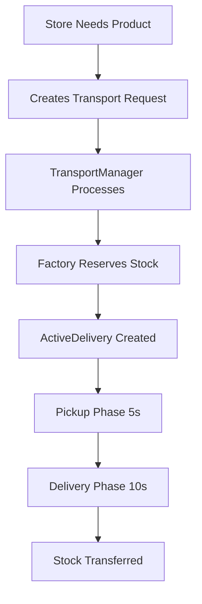
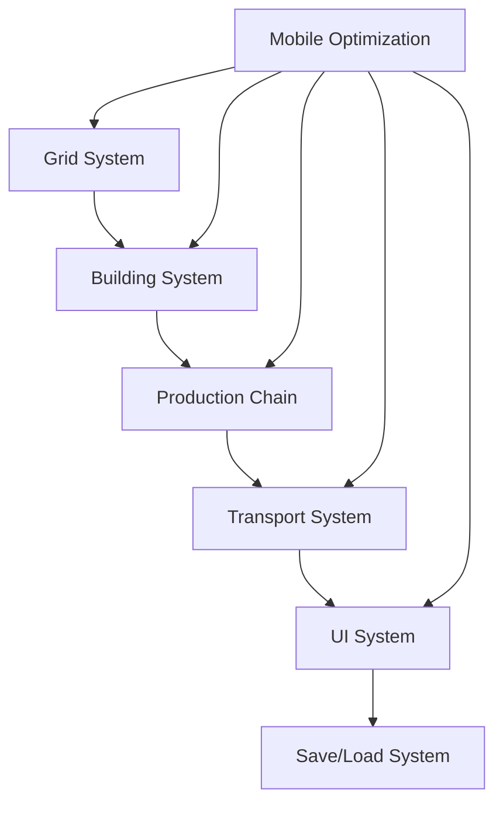

# 📊 Systems Reference

> [!abstract] **Technical Hub**
> Central reference for all technical systems, implementation status, and integration details.

#systems-reference #technical-architecture #implementation-status

---

## 🎯 Quick System Overview

### **At a Glance**
| System | Status | Priority | Integration |
|--------|--------|----------|-------------|
| Grid & Building | ✅ Implemented | Core | Foundation |
| Transport & Logistics | ✅ Basic System | Core | Building System |
| Production Chain | ✅ Basic System | Core | Transport System |
| UI & Mobile Controls | 🔄 Basic | Core | All Systems |
| Performance & Optimization | 📋 Needs Work | High | Runtime |
| Save/Load System | 📋 Placeholder | Medium | Data Management |
| Monetization | 📋 Placeholder | Low | Business Logic |

### **Current Development Focus**
> [!info] **What's Actually Built**
> Based on existing codebase and CLAUDE.md documentation

> [!warning] **What Needs Documentation**
> Many systems need proper documentation review

---

## 🏗️ Core Systems

### **Grid & Building System** `#core-system` `#complete`
> [!info] **Purpose**
> Foundation system for all gameplay - handles building placement, grid management, and spatial relationships

**Key Components:**
- **GridManager.cs** - Visual grid mesh and positioning
- **Node.cs** - Grid cell state management (Empty/Road/Building)
- **BaseBuilding.cs** - Abstract building base with stock management
- **BuildingType.cs** - ScriptableObject templates for building definitions

**Implementation Status:** ✅ **Implemented**
- Grid visualization (per CLAUDE.md)
- Building placement and alignment (per CLAUDE.md)
- Stock management system (per CLAUDE.md)
- 3D text display system (per CLAUDE.md)

**Integration Points:**
- [[📊 Transport System]] - Buildings generate/consume transport requests
- [[📊 Production Chain]] - Buildings follow production recipes
- [[📊 UI System]] - Building interaction and status display

---

### **Transport & Logistics System** `#core-system` `#in-progress`
> [!info] **Purpose**
> Automatic truck logistics inspired by Mini Metro/Mini Motorways - handles all goods movement

**Current Architecture:**


**Implementation Status:** ✅ **Basic System Implemented**
- **TransportRequest** - Delivery order data structure (per CLAUDE.md)
- **ActiveDelivery** - Delivery simulation system (per CLAUDE.md)
- **TransportManager** - Central coordination singleton (per CLAUDE.md)
- **Resource Reservation** - Stock management flow (per CLAUDE.md)

**Known from CLAUDE.md:**
- Demand-driven system (stores request when low stock)
- Two-phase delivery simulation
- 3-second game tick processing
- Resource reservation system

**What's NOT implemented yet:**
- Visual truck movement
- Pathfinding
- Traffic system

**Integration Points:**
- [[📊 Grid System]] - Uses road network for pathfinding
- [[📊 Building System]] - Responds to building requests
- [[📊 UI System]] - Shows delivery status and truck information

---

### **Production Chain System** `#core-system` `#complete`
> [!info] **Purpose**
> Handles resource production, processing, and consumption across the supply chain

**Flow Architecture:**
```
Raw Materials → Processing → Finished Goods → Customer Orders
```

**Key Components:**
- **ProductionBuilding.cs** - Factory and farm logic
- **Store.cs** - Customer-facing buildings
- **ProductType.cs** - ScriptableObject product definitions
- **InputProduct** - Production recipe requirements

**Implementation Status:** ✅ **Basic System Implemented**
- Production system (per CLAUDE.md)
- Input/output flow (per CLAUDE.md)  
- Store system (per CLAUDE.md)
- Product definitions (per CLAUDE.md)

**Integration Points:**
- [[📊 Transport System]] - Generates transport requests
- [[📊 Grid System]] - Uses building placement system
- [[📊 Economy System]] - Drives income generation

---

## 📱 Platform Systems

### **Mobile Optimization** `#platform-system` `#planned`
> [!warning] **Status**
> Currently placeholder - needs comprehensive development

**Requirements:**
- **Performance Targets:** 60fps on mid-range devices
- **Memory Management:** Efficient object pooling
- **Battery Optimization:** Reduced background processing
- **Touch Controls:** Responsive gesture handling

**Current Status:** 📋 **Placeholder Documentation**
- Basic performance considerations mentioned in original docs
- No specific implementation details available
- Needs actual implementation and testing

**Integration Points:**
- All runtime systems need mobile optimization
- UI system requires touch-friendly design
- Transport system needs efficient update cycles

---

### **Save & Data Management** `#platform-system` `#planned`
> [!warning] **Status**
> Currently placeholder - critical for mobile experience

**Requirements:**
- **Quick Save/Resume:** Essential for mobile interruptions
- **Progress Persistence:** Level completion and scores
- **Settings Storage:** Player preferences and options
- **Future Cloud Sync:** Cross-device progression

**Current Status:** 📋 **Placeholder Documentation**
- Original docs mention "Local save of progress and high scores"
- Easy Save 3 plugin is present in project
- No actual implementation details documented

**Integration Points:**
- All systems need save/load support
- UI system manages save/load interface
- Progress system tracks player advancement

---

## 🔧 Development Tools

### **Unity Setup & Architecture** `#development-tool` `#complete`
> [!success] **Environment**
> **Unity 6000.0.44f1** - All team members must use this version

**Development Dependencies:**
- **Sirenix Odin Inspector** - Advanced inspector attributes
- **Easy Save 3** - Save system (extensive plugin presence)
- **Hot Reload** - Development iteration tool
- **TextMeshPro** - UI text rendering

**Architecture Patterns:**
- **Singleton Pattern** - TransportManager, GameManager
- **ScriptableObjects** - Data definitions (BuildingType, ProductType)
- **Component-Based** - Modular building system
- **Event-Driven** - Planned for UI and scoring systems

**Integration Points:**
- All systems follow established patterns
- Plugin dependencies documented
- Version control considerations

---

### **Debug & Performance Tools** `#development-tool` `#in-progress`
> [!tip] **Current Tools**
> Comprehensive debug logging in transport system

**Available Tools:**
- **FPSDisplay.cs** - Performance monitoring
- **Transport Debug Logging** - Request tracking and fulfillment
- **Building Status Display** - 3D text for stock levels
- **GameManager.debugMode** - Global debug flag

**Needed Tools:**
- Performance profiling integration
- Memory usage tracking
- Network efficiency metrics
- Player behavior analytics

**Integration Points:**
- All systems support debug logging
- Performance monitoring across systems
- Development workflow optimization

---

## 🔄 System Integration Map

### **Core Dependencies**


### **Data Flow**
1. **Grid System** provides spatial foundation
2. **Building System** manages production facilities
3. **Production Chain** generates supply/demand
4. **Transport System** fulfills logistics requests
5. **UI System** displays state and handles input
6. **Save/Load** persists all system states

---

## 🚀 Implementation Priorities

### **Phase 1: Core Gameplay** ✅ **Complete**
- [x] Grid and building placement
- [x] Basic production chain
- [x] Transport request system
- [x] Stock management and reservations

### **Phase 2: Visual Systems** 🔄 **In Progress**
- [ ] Truck movement visualization
- [ ] Road pathfinding system
- [ ] UI polish and mobile optimization
- [ ] Performance optimization

### **Phase 3: Platform Features** 📋 **Planned**
- [ ] Save/load system implementation
- [ ] Mobile-specific optimizations
- [ ] Platform deployment preparation
- [ ] Monetization system integration

### **Phase 4: Advanced Features** 🎯 **Future**
- [ ] Advanced logistics features
- [ ] Social and competitive features
- [ ] Content management system
- [ ] Analytics and telemetry

---

## 🔗 Related Documents

### **Design Documentation**
- [[🎯 Vision & Core Experience]] - Overall player experience goals
- [[🏗️ Gameplay Pillars]] - Core mechanics and fun factors
- [[🎮 Player Journey]] - Progression and learning systems

### **Technical Deep Dives**
- [[🏗️ Grid & Building System]] - Detailed implementation
- [[🚚 Transport & Logistics]] - Logistics system architecture
- [[📱 Mobile Optimization]] - Platform-specific considerations

---

*Updated: 2025-07-11*
*Tags: #systems-reference #technical-architecture #implementation-status #integration-map*